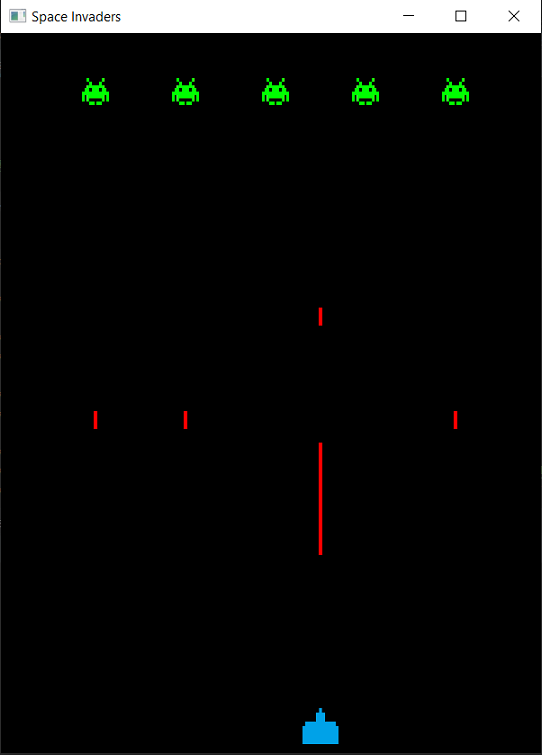

# SpaceInvaders

A JavaFX Space Invaders game Arcade style.

A distrubution package is in 'dist.zip'.
Download the 'dist.zip', unzip and place in any directory of your choice. 
Dubble click on 'SpaceInvaders.bat'.
This will run: java -jar "SpaceInvaders.jar".

Tested:
-------
The 'dist.zip' is tested on Windows 10 and Java 8. 
Possibly it will not work on higher versions of Java (Java 11).

How to play:
------------
[A,Q]    = Move to the Left (depending on if your keyboard is Azerty or Qwerty)

[D]      = Move to the Right

[SPACE]  = Shoot

Screenshot:
-----------

